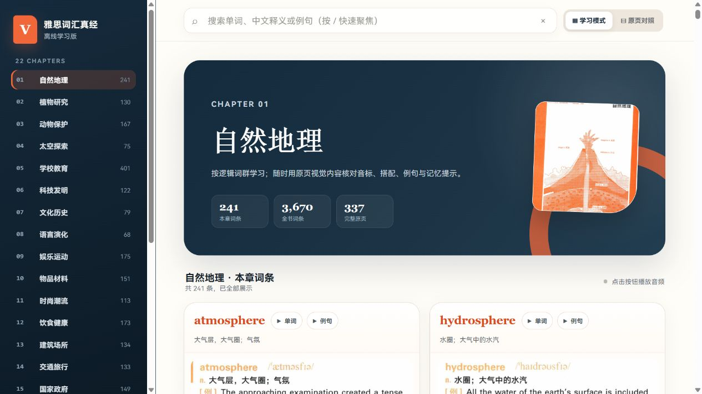
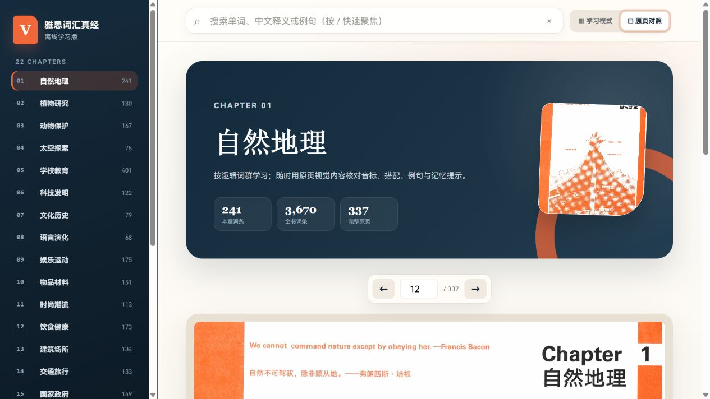

# 雅思词汇真经 · 离线学习版

一个面向本地使用的词汇学习网页与 Android 离线 App。项目提供章节浏览、全书搜索、词条卡片、单词/例句音频和原页对照等功能；Android 版本使用原生 WebView 容器打包，无需联网即可使用。

> [!IMPORTANT]
> 本项目是非官方、未经原教材及相关品牌权利人授权的个人项目。原创程序代码由本仓库所有者本人开发；教材文字、音频、词条图片、原页图片及相关第三方内容的版权归各自原权利人所有。仓库中的代码开源许可证不授予任何第三方内容的使用或再传播权利。公开分发前，请先阅读[版权与第三方内容说明](COPYRIGHT.md)。

## 功能

- 22 个章节、3,670 个词条，支持章节导航与全书搜索。
- 每个词条提供单词和例句音频。
- 词条卡片与 337 页原页内容可相互跳转对照。
- 网页版可由本地静态服务器直接运行。
- Android 版支持手机、平板和横屏，记忆上次阅读位置。
- Android App 不申请网络权限，学习数据不会上传。

## 界面预览

### 学习模式



### 原页对照



## 快速开始

### 网页版

可从 [v1.0.0 Release](https://github.com/nkuerlixinyu-coder/IELTS-Vocabulary-Offline/releases/tag/v1.0.0) 下载 `IELTS-Vocabulary-Offline-Web-1.0.0.zip`。GitHub 自动生成的 “Source code” 压缩包是仓库快照；文件名中带 `Web` 的 ZIP 是整理后的网页版发布包。

解压网页版发布包，或完整克隆仓库后，在包含 `index.html` 与 `assets/` 的目录启动任意静态文件服务器。例如已安装 Python 3 时：

```powershell
python -m http.server 8000
```

然后在浏览器打开 <http://127.0.0.1:8000/>。请保留 `index.html` 与 `assets/` 的相对位置；只下载 `index.html` 无法加载图片和音频。

### Android 版

预编译 APK 应作为 GitHub Release 附件提供，不提交到 Git 历史。下载后可在 Android 7.0（API 24）及以上设备安装；从 GitHub 下载的 APK 可能需要在系统设置中临时允许“安装未知应用”。

从源码构建需要：

- JDK 17；
- Android SDK Platform 36；
- Windows PowerShell（使用仓库自带的 Gradle Wrapper）。

首次使用 Gradle Wrapper 时需要联网下载 Gradle；已有离线 Gradle 9.4.1 时，也可将其目录设置为 `GRADLE_HOME`。

在 PowerShell 中运行：

```powershell
cd android-app
.\build-apk.ps1
```

输出文件位于 `android-app/dist/`，同时会生成 SHA-256 校验文件。当前脚本生成的是 Android 调试签名 APK，适合本地安装和测试；公开发布前建议配置并妥善保管自己的长期 release 签名密钥。详细流程见[发布检查清单](docs/RELEASING.md)。

## 项目结构

```text
.
├─ index.html                 # 网页入口、界面逻辑及内嵌词条数据
├─ assets/
│  ├─ audio/                  # 第三方音频资源
│  ├─ cards/                  # 第三方词条图片
│  └─ pages/                  # 第三方原页图片
├─ android-app/               # Android 原生容器工程
├─ docs/
│  ├─ screenshots/            # README 截图
│  └─ RELEASING.md            # 发布检查清单
├─ release/v1.0.0/            # Release 说明与校验值
├─ COPYRIGHT.md               # 版权、许可证边界与删除机制
└─ LICENSE                    # 仅适用于原创程序代码的 MIT 许可证
```

仓库包含约 672 MiB 的图片和音频资源，完整克隆或下载需要一定时间。Android 构建目录、IDE 配置、本机 SDK 路径、签名密钥以及 APK/AAB 文件均已由 `.gitignore` 排除。

## 版权与免责声明

本项目为个人学习过程中开发的非商业开源项目，主要目的是提供 PDF、音频同步播放及点读学习功能，方便个人语言学习与资料整理。

### 软件部分

本项目中由开发者原创的程序代码、界面逻辑、音频同步逻辑及相关技术实现，按照本仓库所注明的开源许可证发布。

开源许可证仅适用于本项目原创的软件代码及开发者有权许可的内容，不代表对仓库中可能涉及的任何第三方作品授予许可。

### 第三方内容

本项目可能涉及教材、文本、图片、录音或其他第三方内容。

上述内容的著作权、邻接权、商标权及其他相关权利均归原作者、出版机构、录音制作者或其他合法权利人所有。

本项目与相关作者、出版社、教育机构及品牌方不存在官方合作、授权、赞助或隶属关系，除非另有明确说明。

### 项目用途

本项目由开发者出于个人学习、技术研究及软件功能展示目的制作，目前不收取费用，不通过第三方教材或音频内容直接获取商业收益。

“不收费”或“非商业使用”并不当然意味着第三方内容可以未经授权自由复制或传播。使用者应自行确保其使用、导入或传播的资料具有合法来源和相应使用权限。

### 关于资源来源

部分学习资料可能来源于公开互联网。公开可访问并不意味着相关作品已经进入公共领域，也不意味着原权利人已经允许再次复制、修改或传播。

如第三方资料存在版权或其他权利争议，应以实际权利人的权利状态和授权条件为准。

### 权利人联系与移除

如果您是本项目所涉及内容的作者、出版者、录音制作者、表演者、商标权人或其他合法权利人，并认为仓库中的某项内容侵犯了您的合法权益，请通过本仓库的 Issue 或项目中提供的联系方式与维护者联系。

请尽可能提供：

* 权利人身份或授权代表信息；
* 涉及作品或内容的名称；
* 涉及文件、页面或链接的位置；
* 权利证明或能够说明权利归属的信息；
* 希望采取的处理方式。

在收到合理、可核实的权利主张后，维护者将及时核查，并视具体情况采取删除、替换、限制访问或其他适当措施。

### 使用者责任

下载、安装、使用或二次分发本项目的用户，应遵守其所在地适用的版权及其他法律法规。

使用者不得将本项目用于未经授权的大规模传播、商业销售或其他侵犯第三方合法权益的用途。

### 商标说明

项目中提及的课程名称、机构名称、产品名称及商标仅用于描述相关资料来源或兼容性。

相关名称及商标归其各自权利人所有。本项目并非相关机构的官方产品，也不代表任何官方认可、授权或推荐。

完整说明另见 [COPYRIGHT.md](COPYRIGHT.md)，原创代码许可证见 [LICENSE](LICENSE)。
